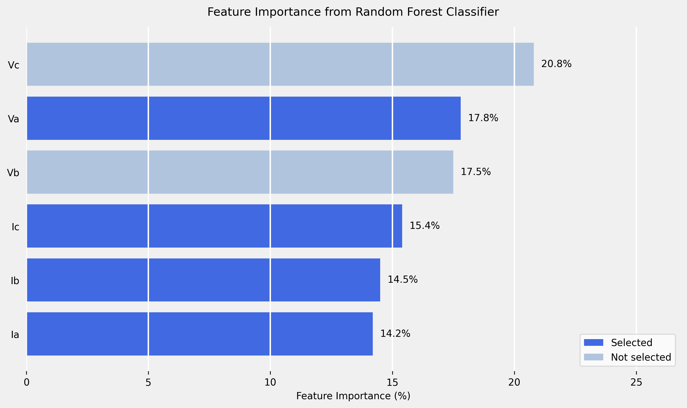
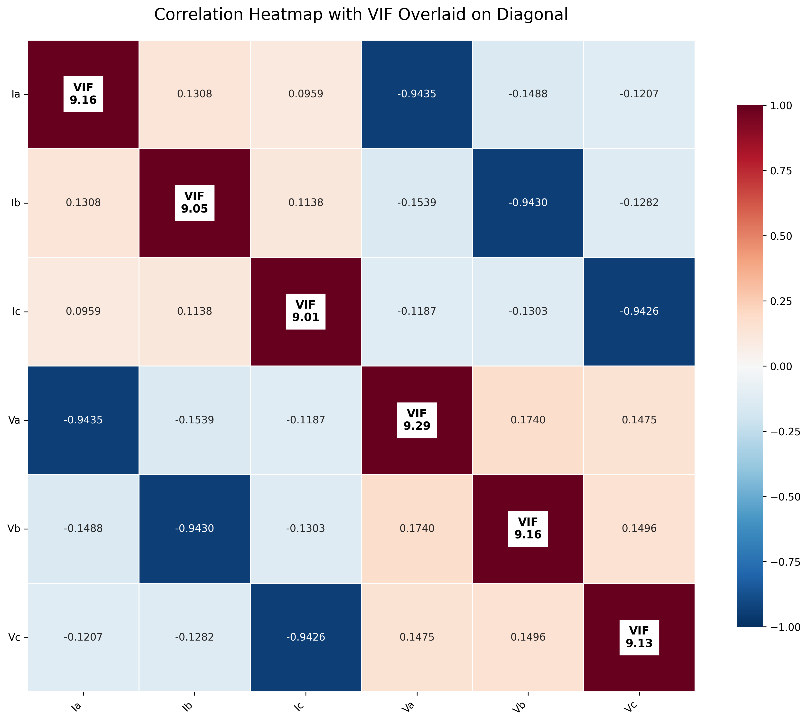
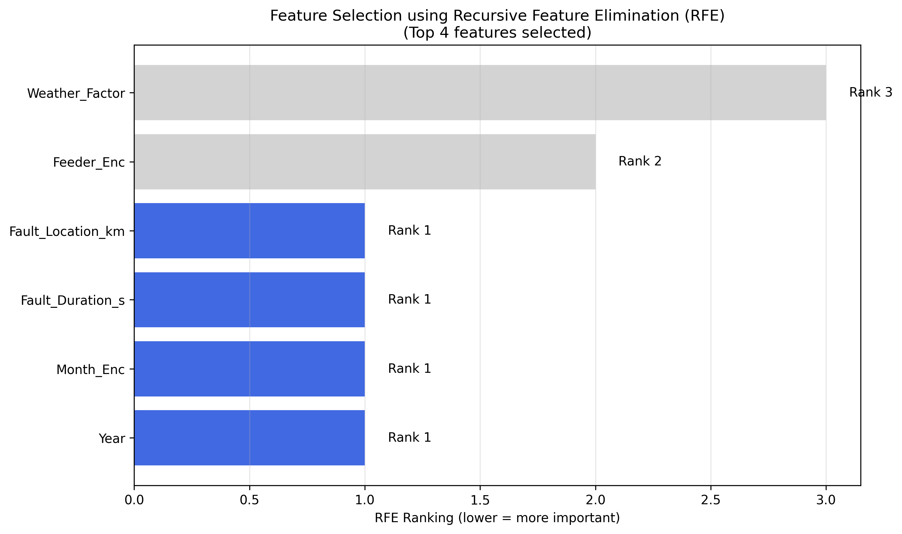
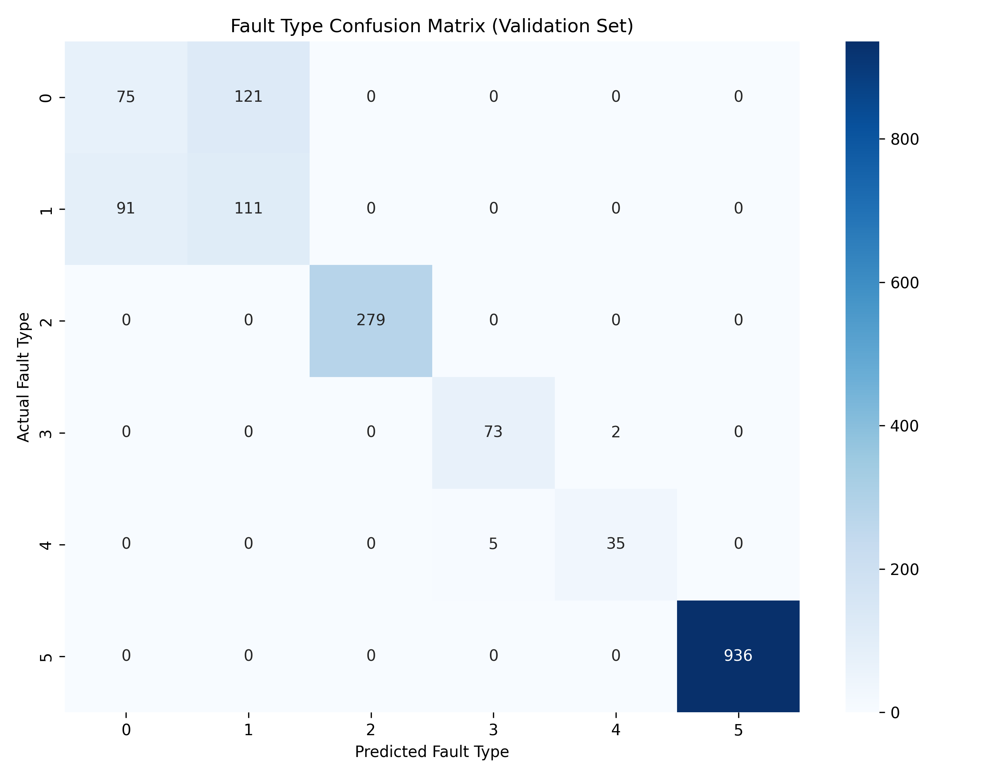
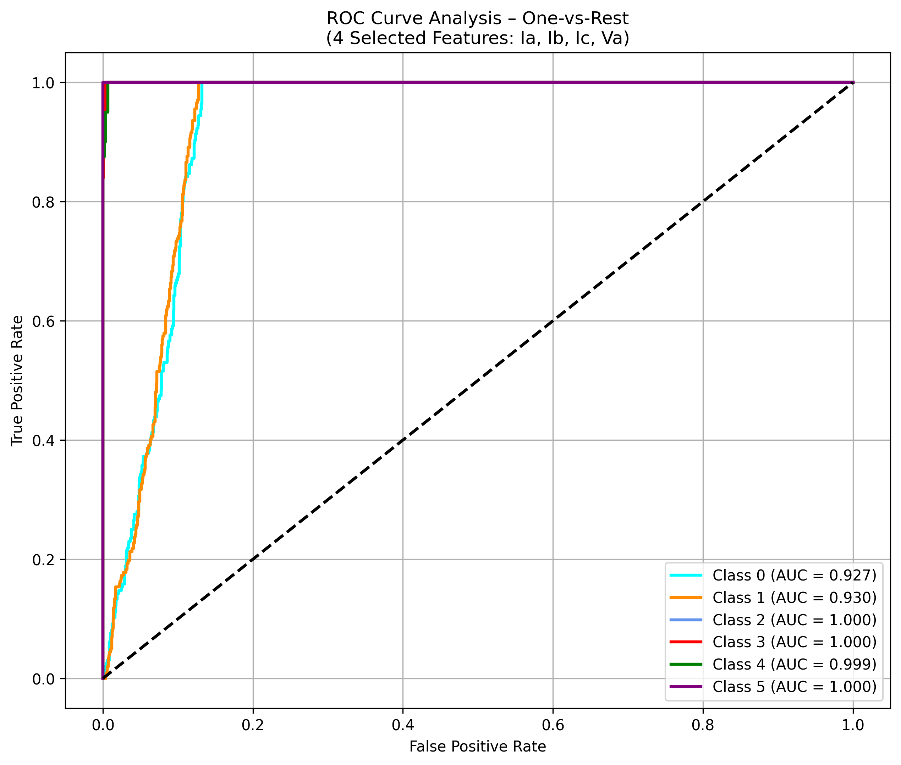
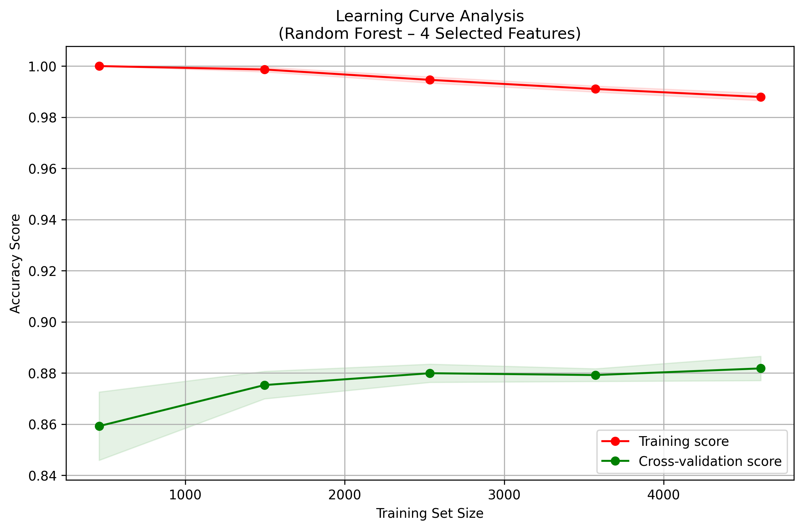

# Nigerian Power Transmission Line Fault Detection Model

> **Final Year Project** — The Use of AI/ML for Predictive Maintenance in Power Transmission Lines  
> Random Forest Classifier for Fault Detection and Prediction on the Nigerian 330kV Transmission Grid

---

## Table of Contents

- [Project Overview](#project-overview)
- [Project Structure](#project-structure)
- [Fault Classification System](#fault-classification-system)
- [Methodology](#methodology)
- [Scripts](#scripts)
- [Installation](#installation)
- [Usage](#usage)
- [Results](#results)
- [Dashboard](#dashboard)
- [Dependencies](#dependencies)
- [Author](#author)

---

## Project Overview

This project applies Machine Learning — specifically a **Random Forest Classifier** — to the problem of predictive maintenance on Nigerian 330kV power transmission lines. The system is trained to detect and classify six types of transmission line conditions (including three fault types and three normal operating states) using electrical measurements sampled at 15-minute intervals.

The dataset is synthetically generated to simulate realistic Nigerian grid conditions, including environmental factors (temperature, humidity, wind speed), peak-load hours (06:00–09:00 and 18:00–21:00), and three fault types commonly observed on high-voltage transmission lines: Line-to-Ground (LG), Line-to-Line (LL), and Line-to-Line-to-Ground (LLG) faults.

The trained model is then used to generate predictions for a future 90-day period (April–June 2025), which are visualised on an interactive Streamlit dashboard.

**Key outcomes:**
- Overall validation accuracy of **87.33%**
- Perfect classification (100% F1-score) for Class 2 (LG Fault) and Class 5 (Healthy)
- Interactive dashboard for real-time fault monitoring and filtering
- Full pipeline from data generation → feature selection → training → prediction → visualisation

---

## Project Structure

```
nigerian-transmission-fault-detection/
│
├── data_generation.py              # A.1 — Synthetic dataset generation (train + test)
├── feature_visualization.py        # Correlation heatmap + VIF overlay (quantitative feature selection)
├── feature_importance_plot.py      # RF feature importance bar chart (visual feature selection)
├── feature_selection_plot.py       # RFE feature ranking plot
├── train_model.py                  # A.2 — Model training, evaluation, learning curve
├── predict_future.py               # A.3 — Future fault prediction (Apr–Jun 2025)
├── dashboard.py                    # Streamlit interactive dashboard
│
├── train_dataset.csv               # Generated training data (Jan–Mar 2025, 8,640 samples)
├── test_dataset.csv                # Generated prediction data (Apr–Jun 2025, 8,736 samples)
├── nigerian_test_data_with_predictions.csv  # Test data with predicted fault types
│
├── model.joblib                    # Saved trained Random Forest model
├── scaler.joblib                   # Saved MinMaxScaler (fitted on training data only)
│
├── confusion_matrix.png                        # Confusion matrix (validation set)
├── roc_curve_analysis_4features.png            # ROC curve (one-vs-rest, 6 classes)
├── learning_curve_analysis_4features.png       # Learning curve (train vs CV score)
├── correlation_heatmap_with_vif_overlay.png    # Correlation matrix + VIF overlay
├── feature_importance_rf.png                   # RF feature importance bar chart
├── Feature_Selection_RFE_Plot.png              # RFE feature ranking plot
│
└── README.md
```

---

## Fault Classification System

The model classifies each 15-minute reading into one of six classes:

| Class | Label | Description |
|-------|-------|-------------|
| 0 | Normal A | Normal operation — moderate load |
| 1 | Normal B | Normal operation — varying load |
| 2 | LG Fault | Line-to-Ground fault (single phase) |
| 3 | LL Fault | Line-to-Line fault (two phases) |
| 4 | LLG Fault | Line-to-Line-to-Ground fault (two phases) |
| 5 | Healthy | Balanced, low-noise healthy operation |

**Fault injection characteristics:**

| Fault | Voltage drop | Current surge |
|-------|-------------|---------------|
| LG    | 40–80%      | 300–700%      |
| LL    | 50–70%      | 400–600%      |
| LLG   | 60–90%      | 500–800%      |

---

## Methodology

### 1. Synthetic Data Generation
Three-phase electrical signals (Ia, Ib, Ic, Va, Vb, Vc) are generated at 15-minute intervals for the Nigerian 330kV grid (V_phase = 190.5 kV, I_nominal = 650 A). Fault probability is dynamically modulated by:
- **Environmental conditions** — temperature > 35°C or humidity > 80% increases fault probability by 1.8×
- **Peak load hours** — 06:00–09:00 and 18:00–21:00 increases fault probability by 1.3×
- **Fault class distribution** — LG (70%), LL (20%), LLG (10%) among all fault events

### 2. Feature Selection
Two complementary approaches are used to justify the final selection of `Ia, Ib, Ic, Va`:

- **Quantitative** — Pearson correlation matrix + Variance Inflation Factor (VIF) overlay to identify multicollinearity among all 6 electrical features
- **Visual** — Random Forest feature importance bar chart ranking all 6 features by predictive contribution

### Feature Importance


### Correlation Heatmap with VIF


### RFE Feature Ranking


### 3. Data Preprocessing
- **Train/validation split** — 80/20 stratified split
- **Scaling** — MinMaxScaler fitted exclusively on training data to prevent data leakage; applied to validation and test sets using the saved scaler

### 4. Hyperparameter Tuning
`RandomizedSearchCV` with 20 iterations and 5-fold cross-validation across:
- `n_estimators`: [100, 200, 300]
- `max_depth`: [10, 20, 30, None]
- `min_samples_split`: [2, 5, 10]
- `min_samples_leaf`: [1, 2, 4]

**Best parameters found:** `n_estimators=100`, `max_depth=10`, `min_samples_split=2`, `min_samples_leaf=1`

### 5. Evaluation
- Confusion matrix
- Classification report (precision, recall, F1-score per class)
- ROC curve — one-vs-rest for all 6 classes
- Learning curve — training score vs cross-validation score across training set sizes

### 6. Prediction & Dashboard
The saved model predicts fault types for April–June 2025 (8,736 samples). Results are visualised on an interactive Streamlit dashboard with date filtering, fault type filtering, KPI metrics, and CSV download.

---

## Scripts

### `data_generation.py` — A.1
Generates two CSV files:
- `train_dataset.csv` — January–March 2025 (8,640 samples, 90 days × 96 readings/day)
- `test_dataset.csv` — April–June 2025 (8,736 samples, 91 days × 96 readings/day)

### `feature_visualization.py`
Produces the **correlation heatmap with VIF overlay** for all 6 electrical features. VIF values are displayed on the diagonal of the heatmap. Used as quantitative justification for feature selection.

### `feature_importance_plot.py`
Produces the **RF feature importance bar chart** with selected features highlighted in dark blue and unselected in light blue. Importance values printed to terminal as a summary table.

### `train_model.py` — A.2
Full training pipeline:
1. Loads `train_dataset.csv`
2. Splits into train/validation (80/20 stratified)
3. Fits MinMaxScaler on training data only
4. Runs `RandomizedSearchCV` for hyperparameter tuning
5. Evaluates on validation set (accuracy, classification report, confusion matrix)
6. Generates ROC curve and learning curve
7. Saves `model.joblib` and `scaler.joblib`

### `predict.py` — A.3
Loads saved `model.joblib` and `scaler.joblib`, applies them to `test_dataset.csv`, and saves predictions to `nigerian_test_data_with_predictions.csv`.

### `dashboard.py`
Interactive Streamlit dashboard featuring:
- Date range and fault type filters (sidebar)
- KPI cards — total records, fault events, normal/healthy count, fault rate
- Fault frequency line chart over time
- Fault type distribution horizontal bar chart
- Electrical signal plots for Ia, Ib, Ic, Va
- Fault type breakdown table
- Raw predictions table
- CSV download button

---

## Installation

### 1. Clone the repository
```bash
git clone https://github.com/YOUR_USERNAME/nigerian-transmission-fault-detection.git
cd nigerian-transmission-fault-detection
```

### 2. Create and activate a virtual environment
```bash
# Windows
python -m venv venv
venv\Scripts\activate

# macOS/Linux
python3 -m venv venv
source venv/bin/activate
```

### 3. Install dependencies
```bash
pip install -r requirements.txt
```

---

## Usage

Run the scripts in order:

```bash
# Step 1 — Generate datasets
python data_generation.py

# Step 2 — Feature analysis (optional, for report/analysis)
python feature_visualization.py
python feature_importance_plot.py

# Step 3 — Train the model
python train_model.py

# Step 4 — Generate predictions
python predict.py

# Step 5 — Launch the dashboard
streamlit run dashboard.py
```

The dashboard will open automatically at `http://localhost:8501`.

---

## Results

| Metric | Value |
|--------|-------|
| Validation Accuracy | 87.33% |
| Best CV Accuracy (tuning) | 88.17% |
| n_estimators | 100 |
| max_depth | 10 |
| min_samples_split | 2 |
| min_samples_leaf | 1 |

**Per-class performance (validation set):**

| Class | Precision | Recall | F1-Score | Support |
|-------|-----------|--------|----------|---------|
| 0 — Normal A | 0.4518 | 0.3827 | 0.4144 | 196 |
| 1 — Normal B | 0.4784 | 0.5495 | 0.5115 | 202 |
| 2 — LG Fault | 1.0000 | 1.0000 | 1.0000 | 279 |
| 3 — LL Fault | 0.9359 | 0.9733 | 0.9542 | 75 |
| 4 — LLG Fault | 0.9459 | 0.8750 | 0.9091 | 40 |
| 5 — Healthy | 1.0000 | 1.0000 | 1.0000 | 936 |
| **Weighted avg** | **0.8728** | **0.8733** | **0.8724** | **1728** |

**Observations:**
- Fault classes (2, 3, 4) are detected with high precision and recall — the model reliably identifies actual faults
- Classes 0 and 1 (Normal A and Normal B) show lower scores, likely due to their similar electrical signatures under the same noise distribution
- Class 5 (Healthy) achieves perfect classification owing to its tighter noise profile (0.3% std vs 2% for other normal classes)

### Confusion Matrix


### ROC Curve


### Learning Curve


---

## Dashboard

Launch with:
```bash
streamlit run dashboard.py
```

**Features:**
- Filter by date range (April–June 2025)
- Filter by fault type
- KPI summary cards
- Fault frequency trend over time
- Fault type distribution chart
- Electrical signal visualisation (Ia, Ib, Ic, Va)
- Downloadable filtered CSV

---

## Dependencies

```
pandas
numpy
matplotlib
seaborn
scikit-learn
statsmodels
joblib
streamlit
jinja2
```

Generate `requirements.txt` with:
```bash
pip freeze > requirements.txt
```

---

## Author

**[OGHENEWEDE OVIE NATHANIEL]**  
Final Year Student — Electrical/Electromics Engineering  
[University of Benin]  
[ogheneovienathan@gmail.com]  
[2025]

---

> *This project was developed as a final year undergraduate project on the application of Artificial Intelligence and Machine Learning for predictive maintenance in Nigerian power transmission infrastructure.*